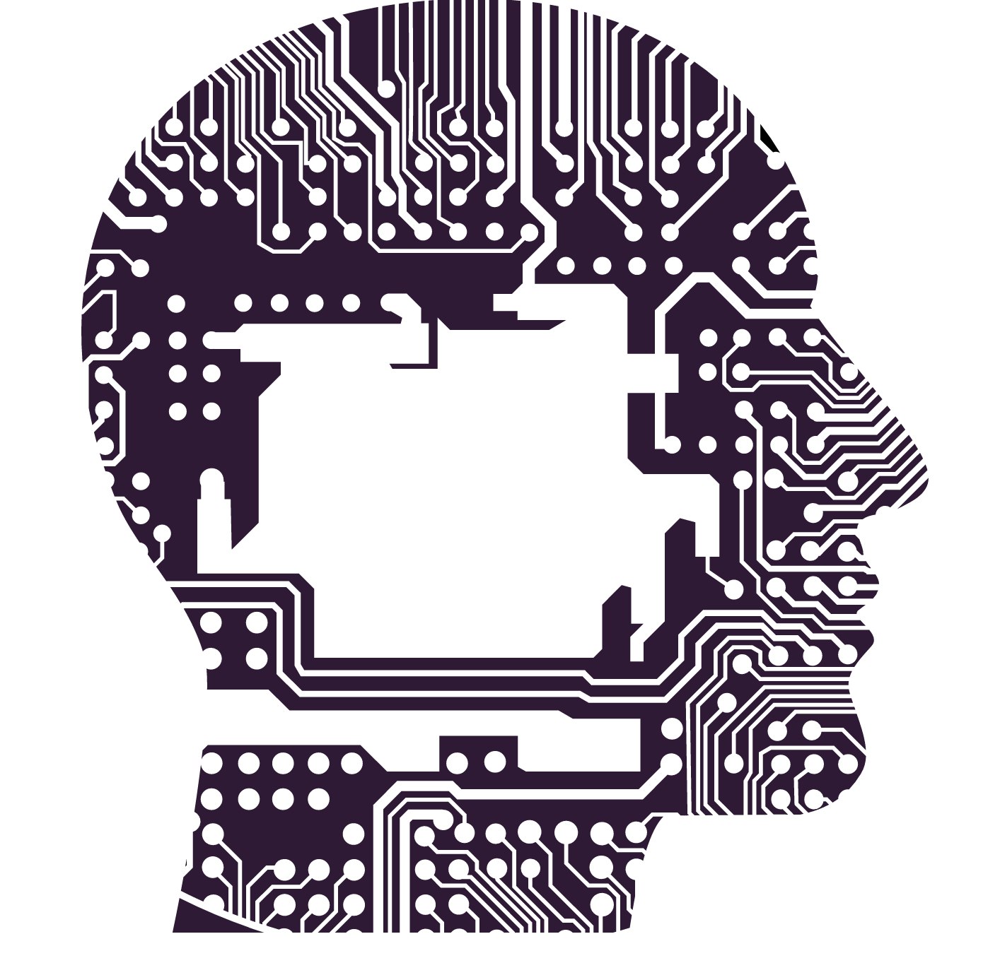

# [HackViolet2022](https://devpost.com/software/cs-simpli)|| [CS Simpli](https://hackviolet.applsauce.repl.co/)

## Inspiration
Our team's inspiration behind this project is to make computer science concepts fun and easy to learn! In the wake of COVID, people have been considering many career changes and computer science has been one of the growing career fields that people are joining. Therefore, our team wanted to have a platform that is beginner-friendly for those interested in computer science and other related tech topics. 

## What it does
CS Simpli introduces you to important computer science fundamentals such as data structures and algorithms in a game format. What better way to learn than by having fun!

## Our Demo

## How we built it
CS Simpli is deployed as a website that was created using HTML, CSS, Javascript, and Bootstrap. Utilizing bootstrap, allowed us to use various HTML components for our project's website. It provided us with lightweight code without the worry of lack of technical experience. 

## Challenges we ran into
The biggest challenge that our team faced was handling the javascript part of the project, which is where all the controls for the game is being managed. 

## Accomplishments that we're proud of
- Our awesome teamwork and seamless communication!

- Our Concept behind CS Simpli's game. You get to learn while playing! The CS Simpli game is set up like a maze that you go through as you test your knowledge on data structures and algorithms!

## What we learned
1. The weird kinks about CSS (divs within a div, positioning of divs)

2. How to create digestible content for an audience

3. How to use Developer Tools in browsers to test design compatibility across different browsers and devices

4. How to use Replit for web development

## What's next for CS Simpli
We hope to add more content to our computer science game curriculum in the future and have more cool resources for learners to use!
